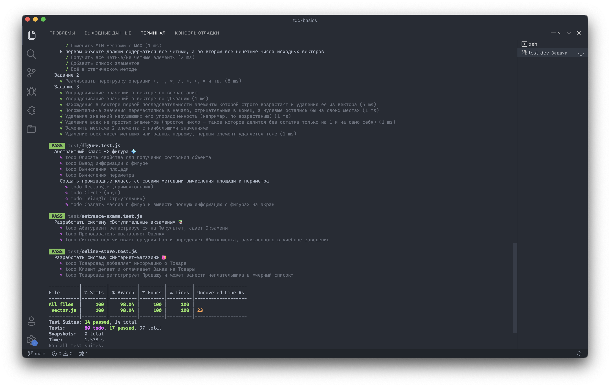

# 🛠 Test-Driven Development basics on js


Основы разработки через тестирование на JavaScript. Условия заданий было взято с учебной программы БГУиР для 3 курса.



### Запуск тестов в режиме разработки

```console
$ npm run test-dev
```

### Задания

- [x] ➡️ [Вектор](./test/vector.test.ts)
- [x] 📐 [Треугольник](./test/triangle.test.ts)
- [x] 💠 [Фигуры](./test/figure.test.ts)
- [ ] 🛒 [Покупатель](./test/customer.test.ts)
- [ ] 😳 [Абонент](./test/subscriber.test.js)
- [ ] 🚛 [«Автобаза»](./test/motor-depot.test.js)
- [ ] 🚉 [«Железнодорожная касса»](./test/railway-ticket-office.test.js)
- [ ] 🛍 [«Интернет-магазин»](./test/online-store.test.js)
- [ ] 🏦 [«Платежи»](./test/payments.test.js)
- [ ] 📚 [«Вступительные экзамены»](./test/entrance-exams.test.js)
- [ ] 🧮 [«Калькулятор логарифмов»](./test/logarithm-calculator.test.js)
- [ ] 🧾 [«Учёт товаров в магазине»](./test/store-inventory.test.js)
- [ ] 🏫 [«Организация учебного процесса в ВУЗе»](./test/educational-process.test.js)
- [ ] 🚂 [«Диспетчер поездов»](./test/train-manager.test.js)

